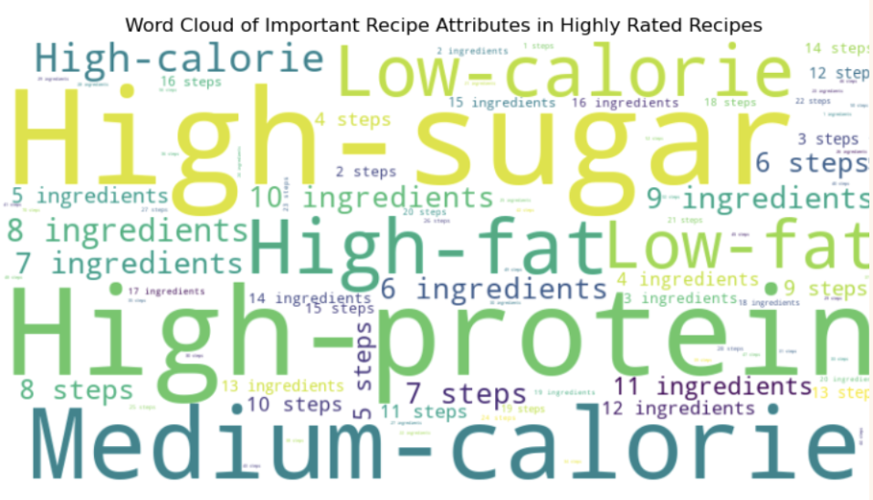
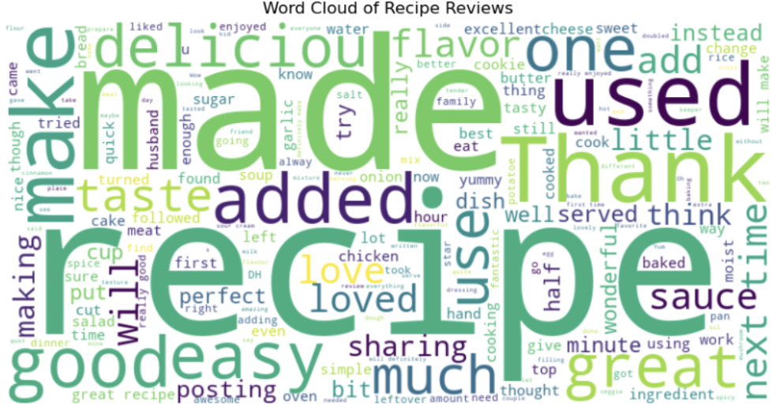
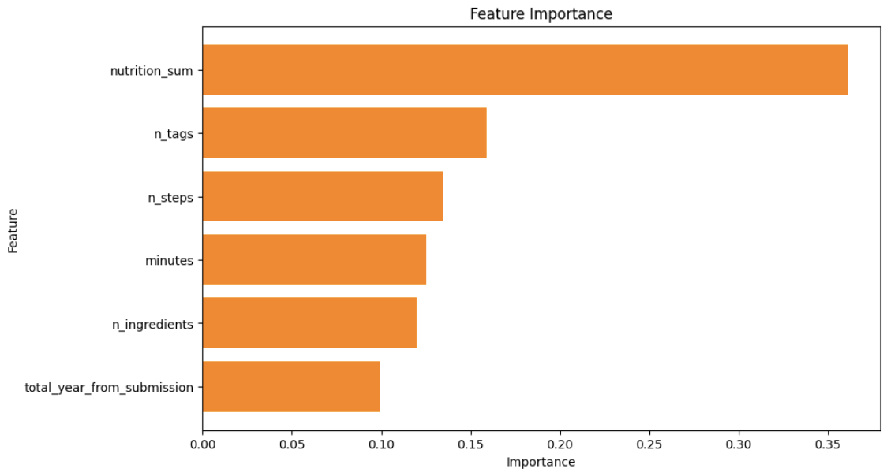

# Recipe Ratings Analysis

## Overview
This project explores which recipe attributes and user sentiments influence high ratings on a recipe-sharing platform. Using machine learning models on two Kaggle datasets, one with recipe features and the other with user reviews, we identify key drivers of recipe success. The analysis offers actionable insights for food bloggers, recipe platforms, and meal kit services to design recipes that better resonate with users.

Prepared by: Vy Nguyen, Kento Morita, Qui Nguyen, Aria Zhou, Sahil Chennadi, Yuheshwar Kamakkapalayam Subramani

Key results include:
- Random Forest achieved the best predictive performance for both attribute-based and sentiment-based models
- Key drivers of high ratings include: number of tags, nutritional content, and review sentiment
- Simpler, healthier, and well-tagged recipes with rich user feedback tend to perform best

## Dataset
- **Source:** Kaggle ([Food.com Recipes and Interactions](https://www.kaggle.com/datasets/shuyangli94/food-com-recipes-and-user-interactions))  
- **Scope:** 
  - `RAW_recipes.csv`: 231,637 recipes with metadata and ingredients  
  - `RAW_interactions.csv`: 1,158,039 user reviews and ratings  
- **Target Variables:** 
  1. Recipe Attribute Modeling: Recipe Rating (0–5 stars)
  2. Review Sentiment Modeling: Binary Recommendation (High Rating ≥4 vs Low Rating <4)

### 📋 Data Dictionary

| Feature                   | Definition                                                                    | Data Type         |
|---------------------------|--------------------------------------------------------------------------------|-------------------|
| minutes                   | Preparation time for the recipe                                               | Numerical         |
| n_steps                   | Number of steps required to make the recipe                                   | Numerical         |
| n_ingredients             | Total number of ingredients used                                              | Numerical         |
| n_tags                    | Number of associated food.com tags (e.g., “low-carb”, “quick”)                | Numerical         |
| nutrition_sum             | Total sum of nutrition values (calories, fat, sugar, protein, etc.)           | Numerical         |
| total_year_from_submission | Number of years since the recipe was published (from 2019)                    | Numerical         |
| review_length             | Word count of the user’s review                                               | Numerical         |
| sentiment_score           | Polarity score of review text (positive/negative sentiment)                  | Numerical         |

## Tools & Methodology Overview
**Languages and Libraries:** Python (pandas, numpy, sklearn, matplotlib, seaborn, nltk, imblearn)

### 1. Recipe Attribute Modeling:
- Joined recipe data with average user rating
- Engineered features: tag count, nutrition sum, years since published
- Target variable: Recipe Rating (0–5 stars)
- Applied: Linear Regression, Generalized Linear Model, Neural Network, and Random Forest
- Evaluation: 10-fold Cross-Validation using MSE

### 2. Review Sentiment Modeling:
- Preprocessed reviews with tokenization, stopword removal, lemmatization
- Engineered features: review length, sentiment score, TF-IDF vectors
- Target variable: binary classification of high (≥4) vs low (<4) ratings
- Applied: Random Forest classifier with SMOTE for class imbalance
- Evaluation: 10-fold Cross-Validation using F1-Score

### Evaluation Metrics:
- For Regression: Mean Squared Error (MSE)
- For Classification: Accuracy, Precision, Recall, F1-Score

## Highlighted Visualizations

**Word Cloud of Recipe Attributes:**  

**Word Cloud of Review Texts:**  

**Feature Importance (Random Forest):**  

## Results & Key Insights
- Random Forest significantly outperformed other models (MSE = 0.145)
- Most predictive attributes: `nutrition_sum`, `n_tags`, and `n_steps`
- Highly-rated reviews include positive words like “delicious,” “easy,” and “flavorful”
- Sentiment polarity strongly correlates with ratings (longer, detailed reviews = more extreme ratings)

## Key Deliverables
- Jupyter Notebooks:  
  - Recipe Attribute Analysis  
  - Review Sentiment Analysis  
- Final Report
- Presentation Slides

## What I Learned
- Combining attribute-based and sentiment-based models provides stronger predictive power
- Feature engineering like `nutrition_sum` and `n_tags` can add meaningful signal
- Review sentiment is a reliable predictor of satisfaction, especially with detailed reviews
- SMOTE is highly effective for dealing with rating imbalance

## What I Plan to Improve
- Implement XGBoost or LightGBM to compare against Random Forest
- Integrate named entity recognition (NER) or topic modeling for deeper review text analysis
- Expand into user-level behavior to recommend recipes based on preferences or history

## About Me
Hi, I’m Vy Nguyen and I’m currently pursuing my MS in Business Analytics at UC Irvine. I’m passionate about data analytics in Finance, Investment, and Consumer Behavior. Connect with me on [LinkedIn](https://www.linkedin.com/in/vy-ngoc-lan-nguyen).
